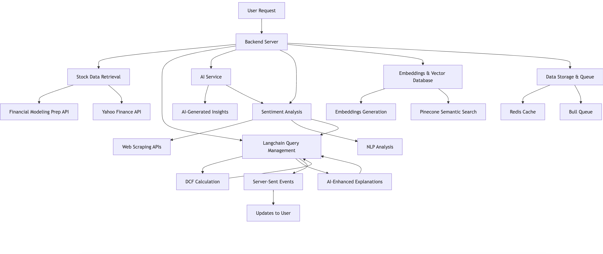

# Deep Value AI

## Overview

Deep Value is a full-stack stock analysis application leveraging AI for intrinsic value estimation and market insights. It integrates a Discounted Cash Flow (DCF) model with AI-generated explanations, real-time data streams, sentiment analysis, and an autonomous LangChain-powered agent for quick stock summaries.

## Core Technologies & Architecture

- **Backend:** Node.js, Express.js, WebSockets (ticker price), Server Sent Events (stream LLM responses as they become available)
- **Frontend:** React (CRA), Tailwind CSS, Flowbite UI components
- **Data Retrieval:**
  - Financials & Quotes: Yahoo Finance, FinancialModelingPrep
  - Real-time Trades: Finnhub (via WebSockets)
  - News: External News APIs
  - Insider Transactions: External Financial Data APIs
  - Earnings transcripts: Scrapes latest earnings reports from Fool.com (only NASDAQ tickers supported)
- **AI & LLM Integration:**
  - OpenAI (GPT-3.5-turbo or similar) for explanations, sentiment analysis, and agent reasoning.
  - LangChain.js for orchestrating LLM interactions, RAG, and agent functionalities.
- **Data Storage & Processing:**
  - Pinecone: Vector database for storing embeddings from news and earnings transcripts (for RAG & semantic search).
  - Redis & BullMQ: Message queue for asynchronous processing of embedding storage, enhancing API responsiveness.
- **Key Services:**
  - Stock data aggregation and DCF (discounted cash flow) calculation.
  - Sentiment analysis module for news
  - Insider Transactions analysis
  - Option Chain analysis
  - Technical Analysis
  - Earnings transcript processing and RAG Q&A
  - Autonomous "Quick Stock Snapshot" agent

## Key Features

1.  **Real-Time Stock Ticker:** Streams live trade data for a selected ticker via a WebSocket connection to Finnhub, managed by the backend.
2.  **DCF Analysis & AI Explanation:** Calculates intrinsic value using a DCF model. Results (best, average, worst-case) are explained by an LLM.
3.  **News Sentiment Analysis:** Fetches and analyzes financial news articles using an LLM to determine sentiment.
4.  **Earnings Transcript Q&A (RAG):**
    - Ingests and processes earnings call transcripts.
    - Stores transcript chunk embeddings in Pinecone.
    - Enables users to ask natural language questions about transcripts, with answers generated by an LLM using relevant retrieved context (RAG).
5.  **Autonomous "Quick Stock Snapshot" Agent:**
    - A LangChain-powered agent that understands user requests for a stock summary.
    - Utilizes custom tools to fetch current price, news sentiment, key technical signals, and insider sentiment.
    - Synthesizes this data into a concise snapshot using an LLM.
6.  **Data-Driven Insights:** Provides AI-generated explanations for technical analysis, options chain data, and insider transactions, and a comprehesnive analysis of all stock data.
7.  **Asynchronous Task Processing:** Uses BullMQ and Redis to offload embedding generation and storage to background workers.

## LangChain Implementation Highlights

LangChain.js is integral for advanced AI functionalities:

- **Agent Framework:** `createOpenAIFunctionsAgent` and `AgentExecutor` are used to build the "Quick Stock Snapshot" agent, enabling it to use tools (custom backend functions) for data retrieval and synthesis.
- **Prompt Engineering:** `ChatPromptTemplate` and `MessagesPlaceholder` structure interactions with LLMs for the agent, sentiment analysis, and explanations.
- **RAG Pipeline:**
  - `RecursiveCharacterTextSplitter` for chunking earnings transcripts.
  - OpenAI embeddings for text vectorization.
  - Pinecone integration (via direct SDK usage or LangChain wrappers) for storing and querying embeddings to find relevant context for LLM-generated answers.
- **Tool Definition:** `DynamicTool` allows existing backend service functions to be exposed as capabilities for the LangChain agent.

## Security Note: Prompt Injection

Basic defenses are implemented for the agent interactions:

- Input sanitization (keyword filtering, length limits) on user queries.
- System prompt reinforcement, instructing the agent to adhere to its designated role and ignore overriding instructions.

- _(This is a foundational step; production systems would require more advanced measures.)_
